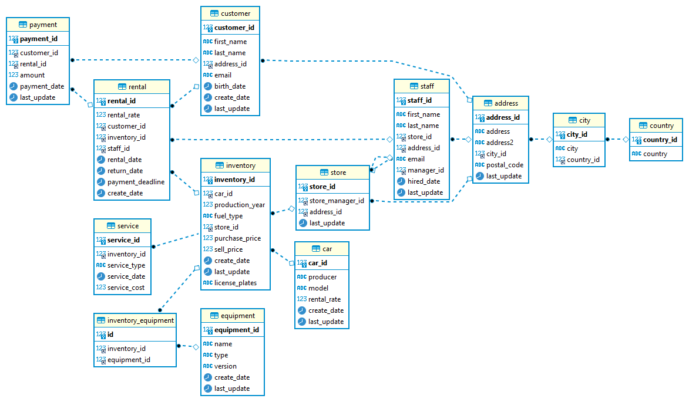
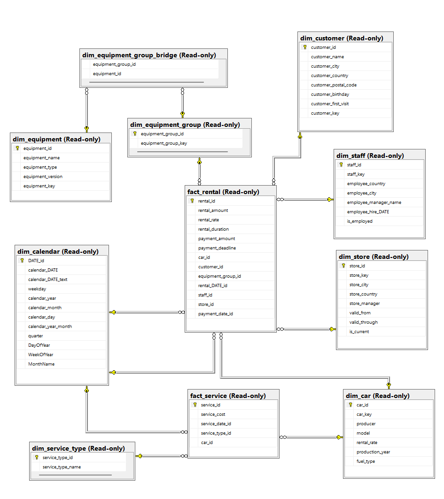
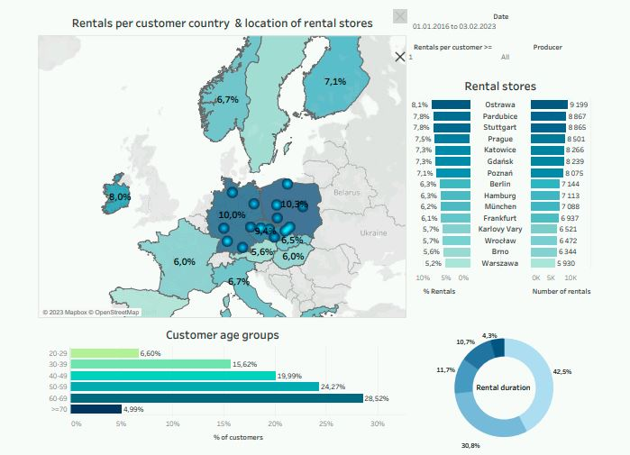
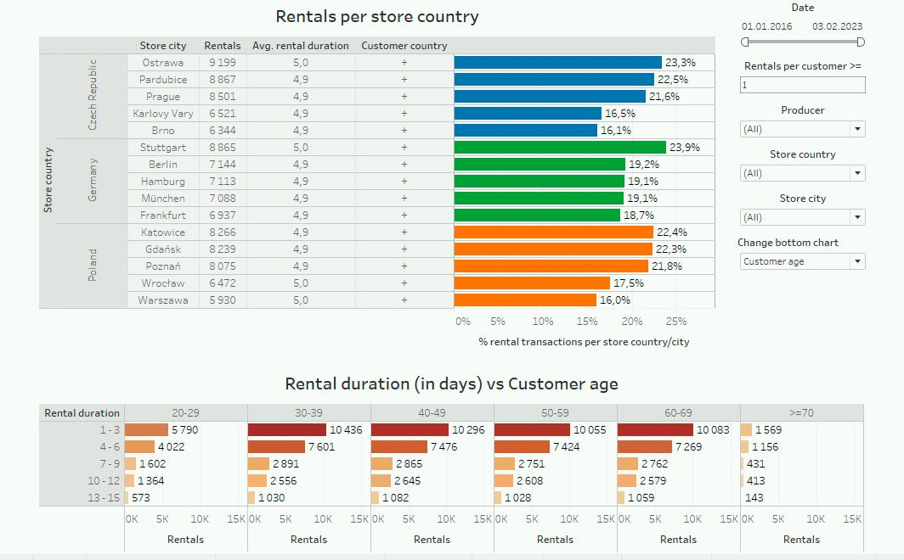
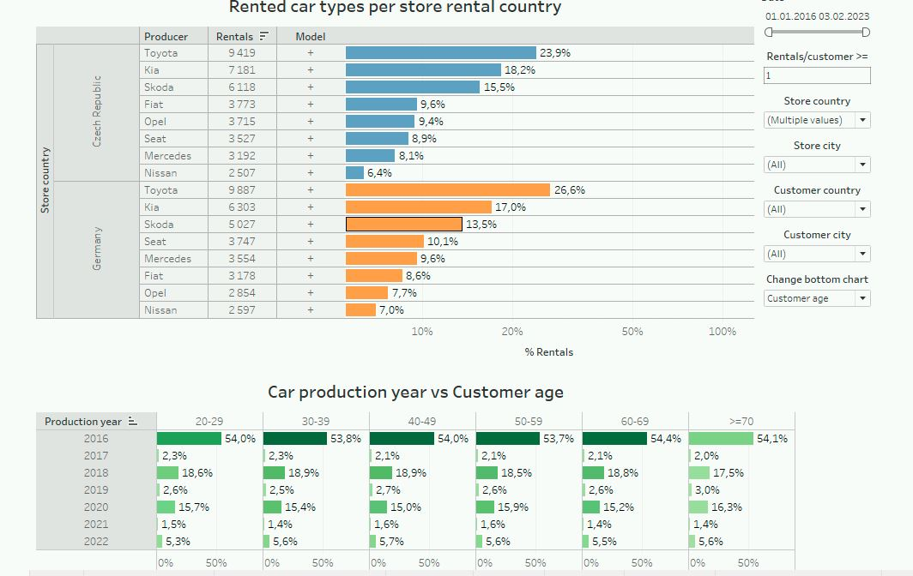

### Project scope
Project consists of the following two parts:
+ Data warehouse project for a car rental company.
  + 
 Designing simplified data warehouse based on Kimball's principles (define grain, dimensions, facts etc.). I used Microsoft SQL Server to create data warehouse structure. 

  + 
 Creating ETL pipelines to populate data warehouse. ETL process includes: full loading of dimension tables, incremental load of the fact table and SCD2 (<i>Slowly Changing Dimension 2</i>) on dim_store. Source data was extracted from MariaDB database called <i>wheelie</i>. I used SSIS to populate data warehouse. 

+ Creating dashboards in Tableau which provide answers to the following questions (related to the customer analysis):
    + 
 Who are customers of our car rental company i.e where they come from, where they rent cars, how old they are?

    + 
 What type of transactions they perform i.e. type of rented cars, rental duration, age/production year of rented cars?

    + 
 Performing analysis of returning customers (def: <b>returning customer</b> - <i>customer who rented a car more than two times</i>).

### Data warehouse schema

1. Entity relationships diagram of the source database (*wheelie* database) is shown below. 

    

2. Schema for data warehouse - dimensions and fact tables. 

    

 As mentioned above fact_rental is incrementally loaded. SCD2 is placed on dim_store.

 One more point to note - to avoid many to many relationship I applied hash function. I used staging table stg_inventory_equipment in the warehouse to hold all pairs of (inventory_id, equipment_id) from the source database (stg_inventory_equipment is loaded 1:1 from <i>wheelie</i> database). Given inventory_id can have many different equipment_ids. Therefore, I applied hash function to combine equipment_ids for a given inventory_id in one unique string: 

<i>
SELECT  
stg.inventory_id, 
CONVERT(NVARCHAR(50), HashBytes('MD5',  STRING_AGG(stg.equipment_id, '|')), 2) equipment_group_key 
FROM [dbo].[stg_inventory_equipment] as stg  
GROUP BY inventory_id 
 </i>
 

Hash keys are hold in dim_equipment_group. Data warehouse tables dim_equipment_group and dim_equipment_bridge are provided to avoid many to many relationship.

### Tableau dashboards

Below there is a preview of dashboards in Tableau. Tableau files (*.twb, *.hyper) can be found in the repository. All dashboards are fully interactive.

1. Customer analysis - map with customer countries and rental store locations. 

    

2. Customer analysis - charts for rental stores. Bar chart include "drill down" option to show the hierarchy: rental store country / rental store city > customer country. Percentage for each store country/store city is counted with the aid of LOD (*Level of Detail Expression*).

3.Customer analysis - charts for car types. Bar chart include "drill down" option to show the hierarchy: rental store country / car producer > car model. Percentage for each store country/car producer is counted with the aid of LOD (*Level of Detail Expression*).

